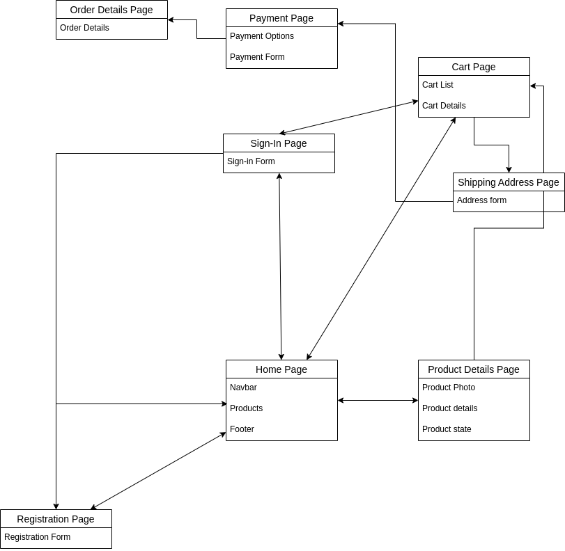
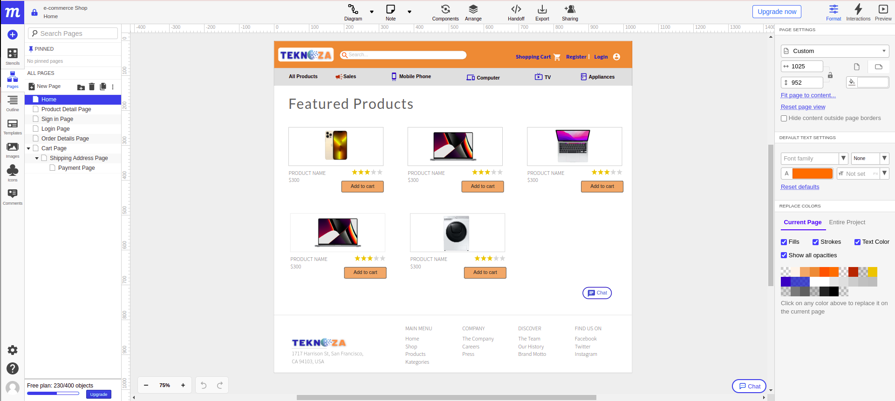
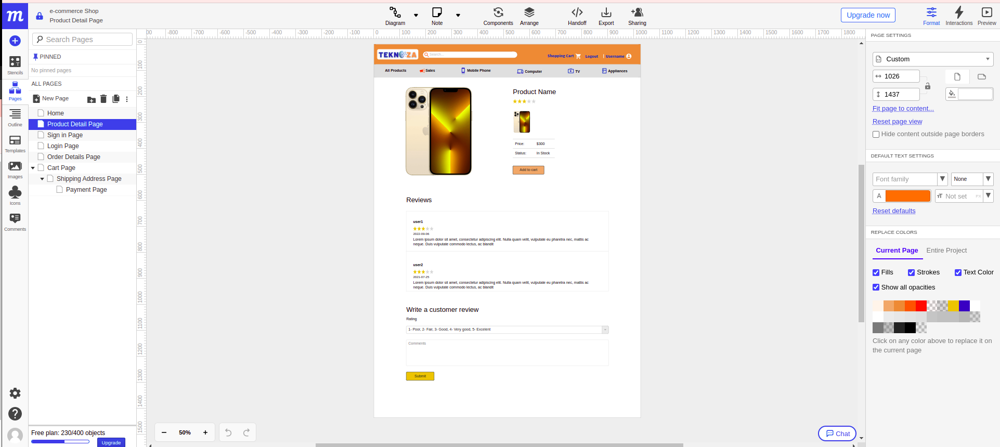
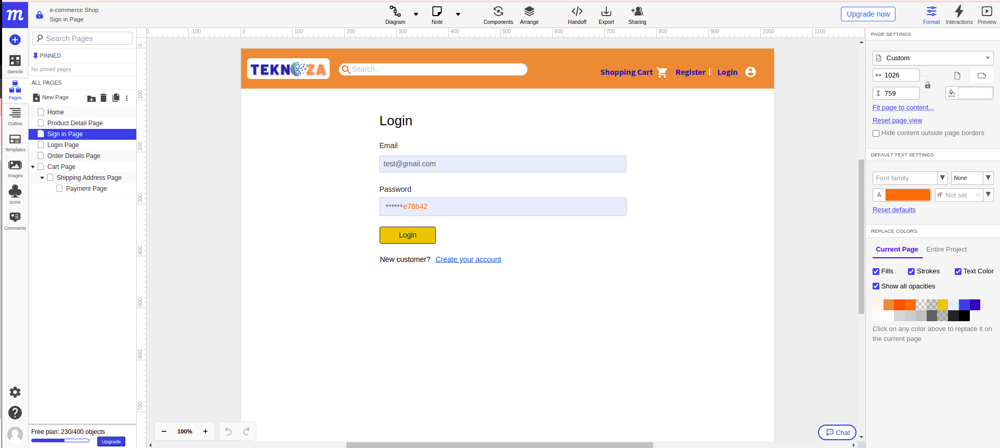
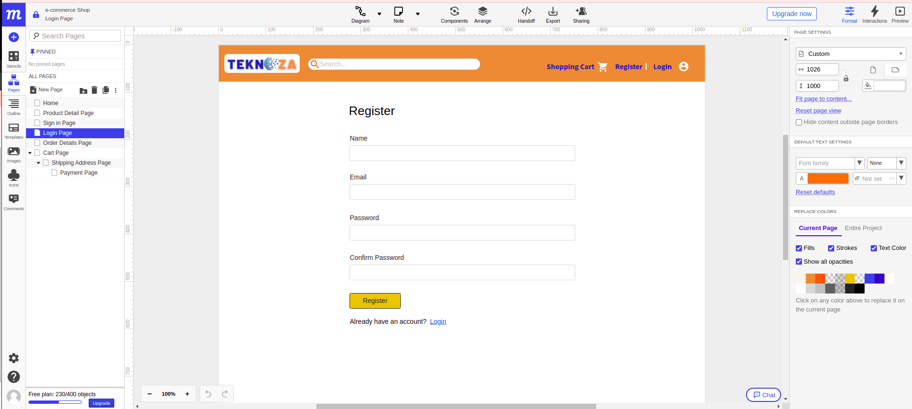
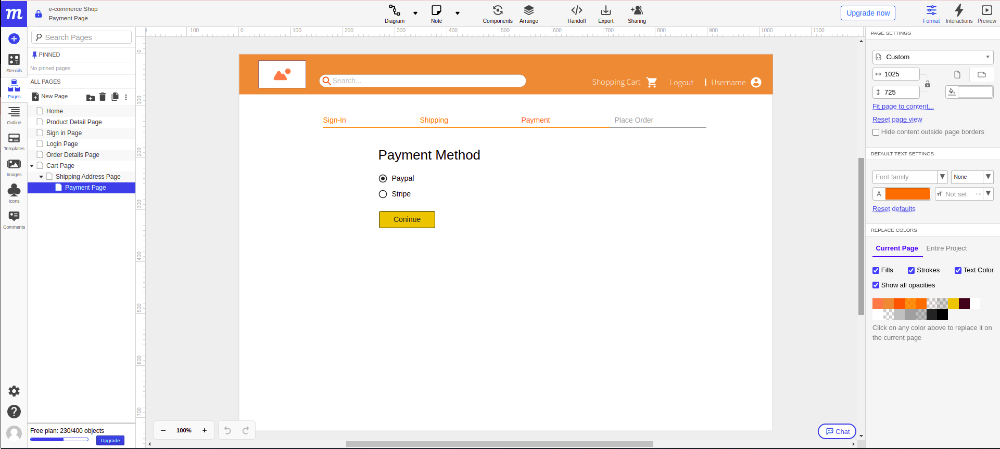
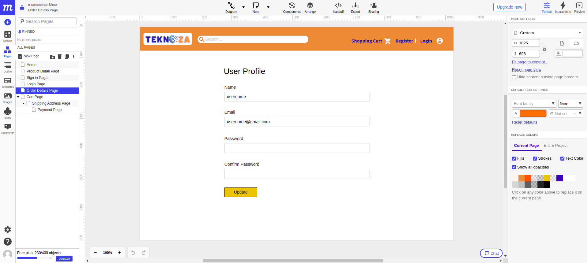
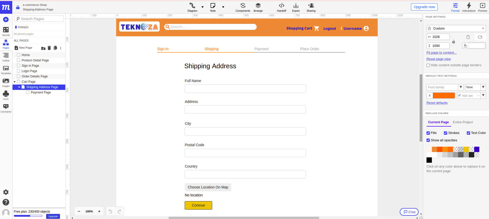
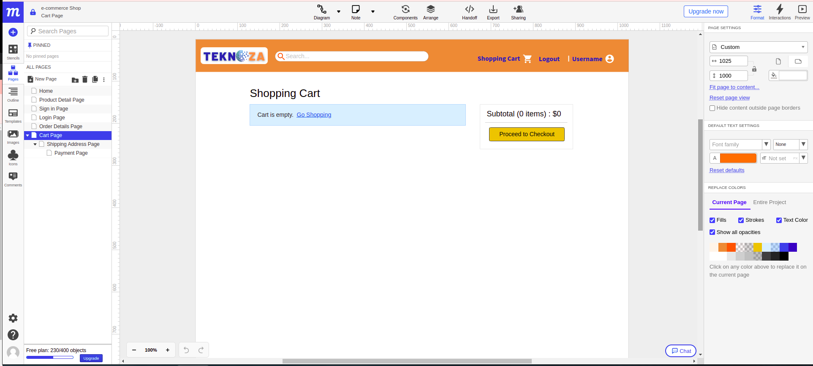

# TEKNOZA - Electronics for everyone

Welcome to Teknoza. This repository is a Final Project for our bootcamp at Digital Career Institute, Germany. We want to create an Open source e-commerce website using MERN stack (MongoDB, ExpressJS, React and Node.JS).

## Pages Diagram



## Mockups

### Homepage



### Product Details Page



### Login Page



### Register Page



### Payment Page



### Customer Details Page



### Shipping Adress Page



### Shopping Cart Page



## Demo Website

It is not live yet. After deployment, the link will be here.

## Technologies

- HTML5 and CSS3
- React
- Context API
- Typescript
- Node.js & Express
- MongoDB
- Development: ESLint, Babel, Git, Github, Trello
- Deployment: Hetzner

## Run locally

### 1. Clone repo

```
$ git clone git@github.com:final-project-onlineshop/teknoza.git
$ cd teknoza
```

### 2. Create .env File

- duplicate .env.example in backend folder and rename it to .env

### 3. Setup MongoDB

- Local MongoDB
  - Install it from [here](https://www.mongodb.com/try/download/community)
  - In .env file update MONGODB_URI=mongodb://localhost/teknoza
- OR Atlas Cloud MongoDB

  - Create database at [https://cloud.mongodb.com](https://cloud.mongodb.com)
  - In .env file update MONGODB_URI=mongodb+srv://your-db-connection

### 4. Run Backend

```
$ cd backend
$ npm install
$ npm start
```

### 5. Run Frontend

```
# open new terminal
$ cd frontend
$ npm install
$ npm start
```

### 6. Seed Users and Products

- Run this on browser: http://localhost:5000/api/seed
- It returns admin email and password and 6 sample products

### 7. Admin Login

- Run http://localhost:3000/signin
- Enter admin email and password and click signin
